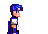
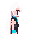
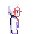
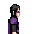

# SDL3 sandbox

A small SDL3-based platformer sandbox (C++23, CMake + Ninja) with TOML-driven stages/characters and an ImGui-first debug UI.

## Ubuntu 24.04 dependencies

```bash
sudo apt update
```

```bash
sudo apt install -y build-essential cmake ninja-build just git pkg-config clang-format clang-tidy cppcheck cpplint iwyu
```

## Optional: SDL3 system feature deps (Linux)

SDL3 is built from source via FetchContent and will auto-detect optional system libraries. Installing these enables more audio/video/input backends on Linux.

```bash
sudo apt install -y \
  libasound2-dev libpulse-dev libaudio-dev libjack-dev \
  libsndio-dev libx11-dev libxext-dev libxrandr-dev libxcursor-dev \
  libxfixes-dev libxi-dev libxss-dev libwayland-dev \
  libxkbcommon-dev libdrm-dev libgbm-dev libgl1-mesa-dev \
  libgles2-mesa-dev libegl1-mesa-dev libdbus-1-dev \
  libibus-1.0-dev libudev-dev fcitx-libs-dev
```

## Build + run

```bash
cmake -S . -B build -G Ninja -DCMAKE_BUILD_TYPE=Debug
```

```bash
cmake --build build
```

```bash
./build/sandbox
```

## Playable content

- Stage: `assets/stages/skyway_run.toml` (Skyway Run).
- Characters: `assets/characters/bolt.toml`, `assets/characters/gale.toml`,
  `assets/characters/nimbus.toml`, `assets/characters/vex.toml`,
  `assets/characters/forge.toml`.
- Dev/test assets live under `assets/dev/` and are used by CTest but are not surfaced in the UI.

## Config highlights

- Stage `[[zones]]` can scale movement/physics, and characters can further tune water/ice behavior via
  `[environment.water]` / `[environment.ice]` multipliers in their TOML.
- Character `[[actions.attacks]]` can define melee or projectile attacks, with optional powerup
  gates via `powerups = ["id"]`.
- Procedural forms support `[form].variants`, named colors, and `anchor_deltas` for silhouette tweaks
  and accessory toggles (see `assets/forms/puppet.toml`).

## Character roster

| Icon | Character | Abilities |
|:----:|-----------|-----------|
|  | **Bolt** | Speed-focused runner with spindash + rolling momentum |
|  | **Gale** | Glide, wall climb/slide, and spindash utility |
|  | **Nimbus** | Floaty jumper with sustained flight (hold action2) |
|  | **Vex** | Agile air-dasher (action1, one midair burst) |
|  | **Forge** | Heavy ground dasher with short burst (action1, grounded only) |

## Tests

```bash
ctest --test-dir build --output-on-failure
```
